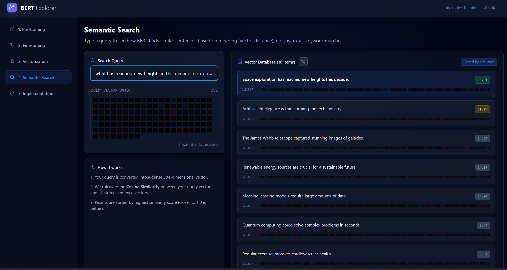
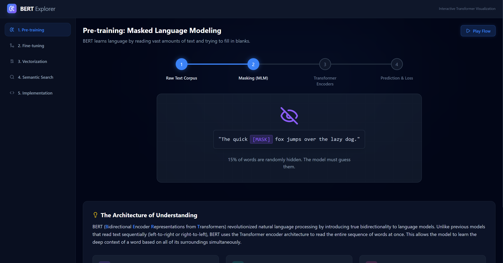

# BERT Explorer Frontend

## Overview

The Visual BERT Frontend is a learning project designed to demystify how transformer models process and understand language. By providing interactive visualizations of BERT's internal mechanisms—such as attention patterns and token embeddings—it enables users to observe how the model extracts semantic meaning from text in real-time. This hands-on approach transforms abstract neural network concepts into concrete, observable behaviors, making it easier to understand model dynamics and decision-making processes.

## Semantic Search



Semantic search leverages BERT's embedding capabilities to find contextually relevant results rather than relying on keyword matching alone. Here's how it works:

1. **Encoding**: Text queries and documents are converted into dense vector embeddings using BERT's encoder
2. **Similarity Matching**: The system compares query embeddings against document embeddings using cosine similarity
3. **Ranking**: Results are ranked by similarity scores, surfacing the most contextually relevant matches
4. **Contextual Understanding**: Unlike traditional search, it captures meaning, synonyms, and intent rather than exact word matches

This enables more intuitive search experiences where results reflect what you meant, not just what you typed.

## Learning Resources



This frontend application includes comprehensive didactic content to help you understand transformer models:

- **Attention Visualization**: Observe how BERT's attention heads focus on different parts of the input text, revealing which tokens the model considers most relevant
- **Token Embeddings**: Explore the high-dimensional vector representations that capture semantic meaning
- **Layer-wise Analysis**: Step through each transformer layer to see how representations evolve
- **Interactive Examples**: Experiment with different inputs and immediately see how the model's internal representations change
- **Guided Tutorials**: Learn core concepts like self-attention, positional encoding, and feed-forward networks through interactive demonstrations

These learning tools transform BERT from a "black box" into an inspectable, understandable system that reveals the mechanisms behind natural language understanding.

## Instalattion

### Prerequisites

- Node.js (v16 or higher)
- npm or yarn package manager

### Install Dependencies

```bash
npm install
```

Or with yarn:

```bash
yarn install
```

### Run Development Server

```bash
npm run dev
```

Or with yarn:

```bash
yarn dev
```

The development server will start and you can access the application in your browser at `http://localhost:3000` (or the port specified in your configuration).